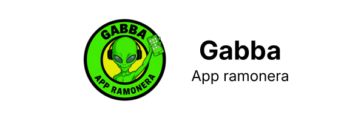

# Gabba

  

     
  

**Gabba** is a mobile application developed with React + Vite and packaged as a native app using Capacitor. It is designed to promote events and content related to Fiesta Ramona.

    

         
  

